# home-automation

## pi local ip address
192.168.1.10

### Current model

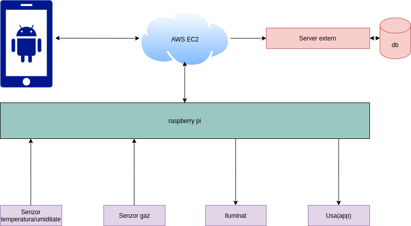

## App screens 

### Login
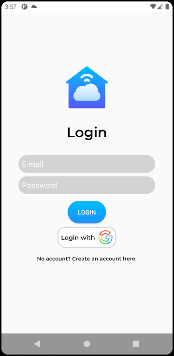

### Register
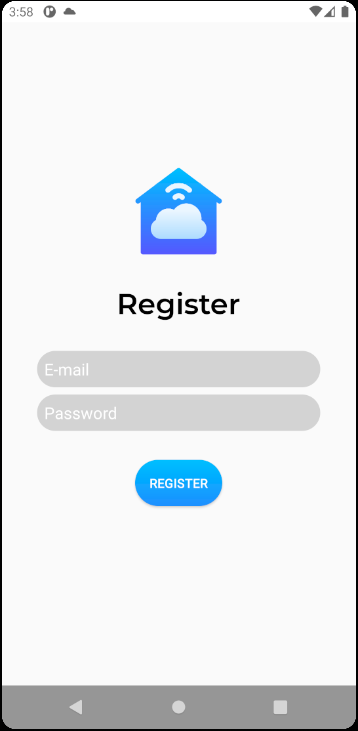

### User info
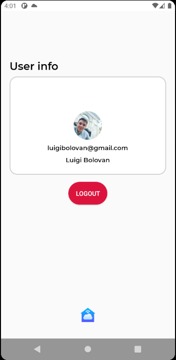

### Dashboard
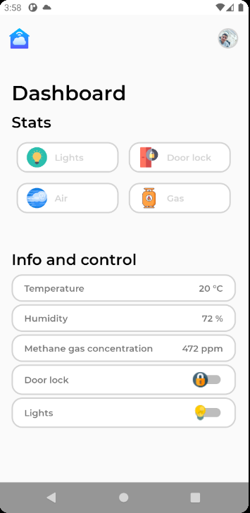

### Door lock
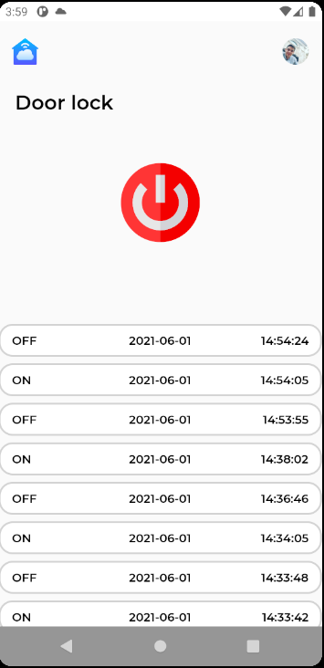

### Lights
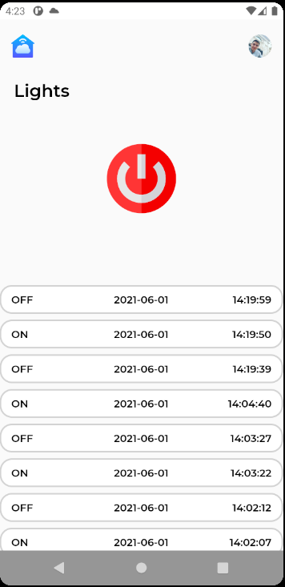

### Methane gas concentration
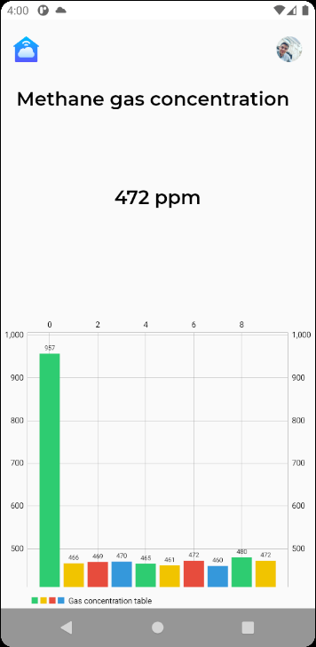

### Temperature and humidity stats
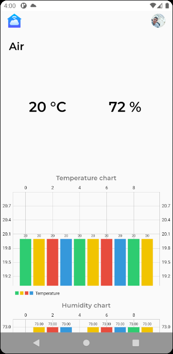

## DB

### Control db
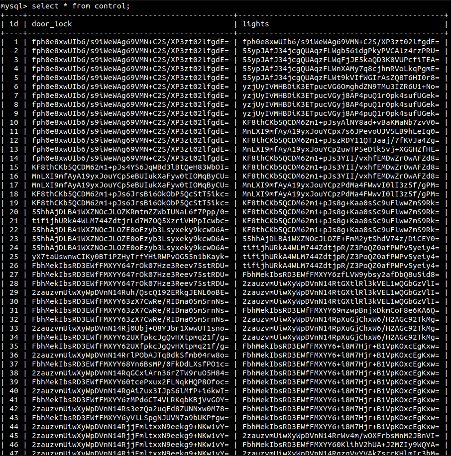

### Air db
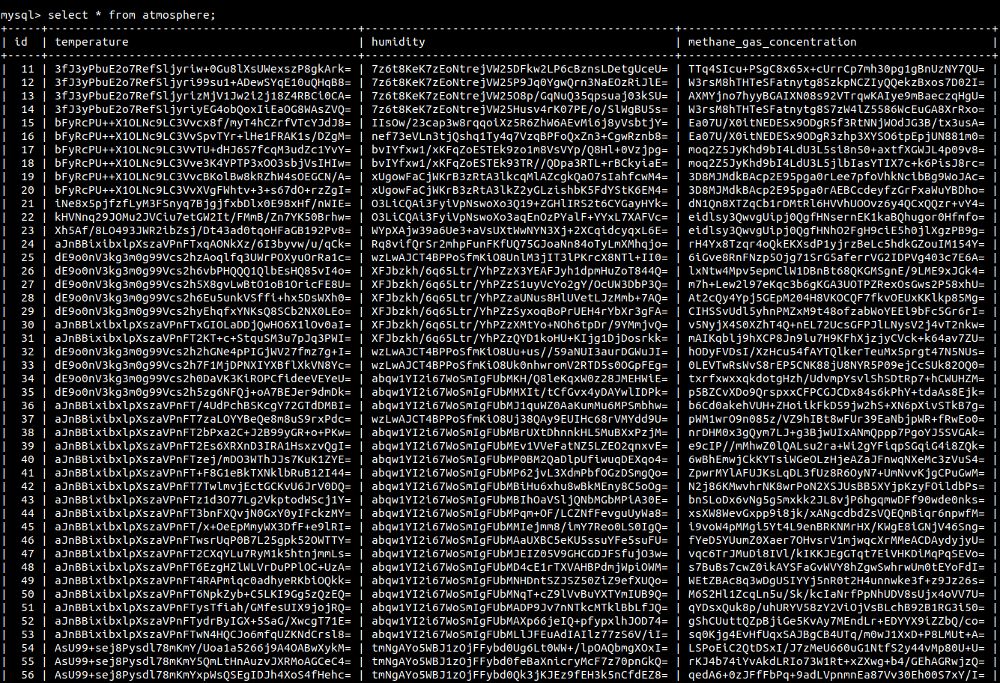
