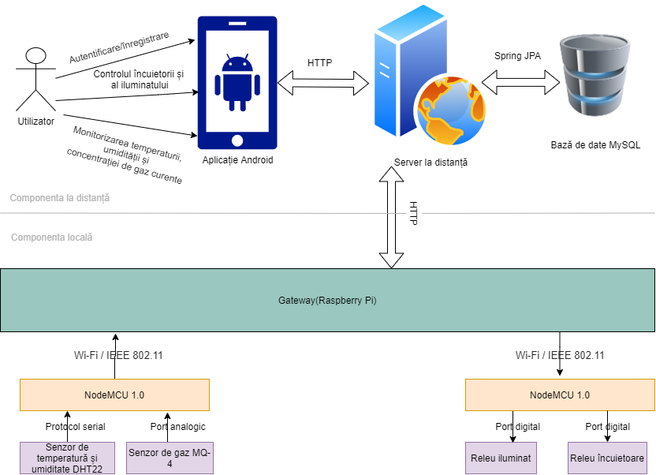

# home-automation

## pi local ip address
192.168.1.10

## aws ec2 public ip
35.158.221.217

## aws db
upt-ac-home-automation-db.c4mrczsvbtnw.eu-central-1.rds.amazonaws.com:3306

### Current model

